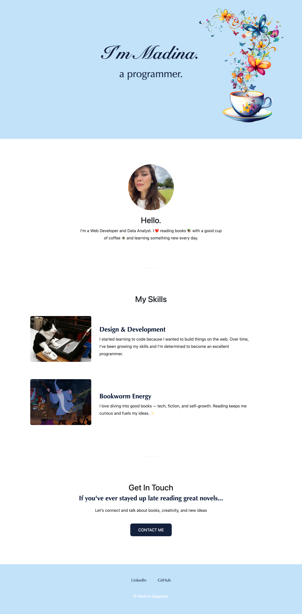

# Madina Sagatova — Personal Website (Capstone 2)

A simple, responsive personal site built with **HTML + CSS** (no JavaScript) to showcase my profile, skills, and contact info as a part of *The Complete Full-Stack Web Development Bootcamp*.

🌐 **Live Demo:** [madinasagatova.github.io/Capstone-2](https://madinasagatova.github.io/Capstone-2/)   
🎯 **Tech:** HTML5, CSS3 (vanilla), responsive layout, semantic markup

---

## ✨ Features
- Hero section with intro (desktop & mobile responsive)
- About me + profile image
- Skills section with fun GIFs (coding + book theme)
- “Get in touch” call-to-action with email button
- Accessible: alt text on images, readable line lengths, semantic tags

---

## 🖼️ Preview


---

## 📂 Project Structure
```
Capstone-2/
├── index.html
├── style.css
├── images/
│ ├── madina-profile.png
│ └── other-images...
├── assets/
│ └── preview.png
└── README.md
```
---

## 🚀 Getting Started (Local)
1. Clone the repo:
   ```bash
   git clone https://github.com/madinasagatova/Capstone-2.git
   cd Capstone-2
   ```
Open `index.html` in your browser.

---

📨 Contact
Email:[madisagatova33@gmail.com](mailto:madisagatova33@gmail.com)
GitHub: [https://github.com/madinasagatova](https://github.com/madinasagatova)
LinkedIn: [https://www.linkedin.com/in/madinasagatova](https://www.linkedin.com/in/madina-sagatova/)

---

## 📄 License

This project is for educational and portfolio purposes.  
Feel free to reference or learn from it, but please do not copy it verbatim.
